# 🛡️ Fault-Tolerant Agent Swarm (Hybrid Architecture)

A robust, multi-agent AI system that combines **Centralized Routing (Supervisor)** with **Decentralized Fallback (Hand-off)** capabilities. Built using **LangChain**, **Google Gemini**, and **SerpAPI**.

---

## 🧐 The Problem Statement
**Goal:** Build a System that reacts intelligently to a user's specific question, even if the initial assignment is wrong.

We have two specialized "Workers" who are experts in their own domains but fail strictly outside of them:

* **🕵️ Agent A (The News Reporter):**
    * **Expertise:** Text processing, headlines, current events.
    * **Limitation:** Cannot handle math, numbers, or stock prices. Fails strictly if asked "What is the price?".
* **📈 Agent B (The Stock Broker):**
    * **Expertise:** Real-time stock prices, financial ratios.
    * **Limitation:** Cannot read long-form news articles.

**The Challenge:**
1.  **Routing:** Automatically send the user's query to the correct expert.
2.  **The "Dabbawala Hand-off":** If the chosen agent fails (e.g., The Reporter is inadvertently asked for a price), the system must detect the crash and automatically hand off the task to the Stock Broker to save the day without the user noticing.

---

## 🏗️ Architecture

This project implements a **Hybrid Orchestrator Pattern** (Centralized + Decentralized):


1.  **The Supervisor (Router):** An LLMChain (Google Gemini) that classifies user intent (`NEWS` vs `STOCK`) and picks the primary agent.
2.  **The Safety Net (Fallback):** A `try/except` logic block. If the Primary Agent raises an exception (e.g., `ValueError: I cannot handle numbers`), the system catches it and triggers the Secondary Agent.

---


```mermaid
graph TD
    %% Nodes
    User(["👤 User Query"])
    Supervisor{"🧠 Supervisor Chain<br/>(Classify Intent)"}
    
    %% Agents
    NewsAgent["🕵️ News Reporter Agent"]
    StockAgent["📈 Stock Broker Agent"]
    
    %% End States
    FinalResult(["📢 Final Answer"])
    
    %% Flow
    User --> Supervisor
    
    %% Routing Decision
    Supervisor -- "Intent: NEWS" --> NewsAgent
    Supervisor -- "Intent: STOCK" --> StockAgent
    
    %% Successful Paths (Green)
    NewsAgent -- "Success" --> FinalResult
    StockAgent -- "Success" --> FinalResult
    
    %% Failure & Hand-off Paths (Red/Dotted)
    NewsAgent -.->|"❌ Error: Price Requested!<br/>(Hand-off Triggered)"| StockAgent
    StockAgent -.->|"❌ Error: Text Requested!<br/>(Hand-off Triggered)"| NewsAgent
    
    %% Styling
    classDef agent fill:#e1f5fe,stroke:#01579b,stroke-width:2px;
    classDef decision fill:#fff9c4,stroke:#fbc02d,stroke-width:2px;
    classDef error stroke:#ff5252,stroke-width:2px,stroke-dasharray: 5 5;
    
    class NewsAgent,StockAgent agent;
    class Supervisor decision;
    linkStyle 4,5 stroke:#ff5252,stroke-width:2px,stroke-dasharray: 5 5;
```

## 🚀 Features

* **Intelligent Routing:** Uses a Supervisor Chain to classify intent, saving API calls by guessing the right agent first.
* **Self-Healing Mechanism:** If the Supervisor guesses wrong or an agent refuses a task, the **Fallback Logic** kicks in to ensure the user still gets an answer.
* **Entity Resolution:** Includes "Universal Trust" logic to handle company rebrands (e.g., understanding that "Eternal Ltd" is "Zomato").
* **Strict Tooling:** Custom tools designed to fail fast on invalid inputs (e.g., News tool crashes on "price" keywords) to trigger the hand-off.

---

## 🛠️ Installation & Usage

### 1. Prerequisites
You need a Google Cloud API Key (for Gemini) and a SerpAPI Key (for Search).

### 2. Clone the Repo
```bash
git clone [https://github.com/YourUsername/Fault-Tolerant-Agent-Swarm.git](https://github.com/YourUsername/Fault-Tolerant-Agent-Swarm.git)
cd Fault-Tolerant-Agent-Swarm
```
### 3. Install Dependencies
```bash
pip install langchain langchain-google-genai langchain-community google-search-results
```
### 4. Configuration
Open the notebook Fault_Tolerant_Agent_Swarm.ipynb. In the **Configuration** cell, replace the placeholder keys with your actual API keys:
```Python

os.environ["GOOGLE_API_KEY"] = "YOUR_GOOGLE_API_KEY"
os.environ["SERPAPI_API_KEY"] = "YOUR_SERPAPI_KEY"
```
### 5. Run the Project
* Open the notebook in Jupyter Lab, VS Code, or Google Colab.
* Run all cells.
* Scroll to the bottom to see the Swarm Intelligence Demo in action.

---

### 📊 Example Logs

**Scenario:** The user asks a tricky question. The Supervisor initially thinks it's "News", but the Agent realizes it requires numbers and fails. The system recovers automatically.
```Plaintext

🔹 User Query: 'Give me a news article about the exact price of Reliance.'

🧠 Supervisor: Deciding who should handle this...
👉 Supervisor assigned task to: [NEWS AGENT]

❌ News Reporter CRASHED: I am a News Reporter! I cannot handle specific numbers or stock prices.
🔄 SYSTEM ALERT: Triggering Fallback to [Stock Broker]...

Search Result: Reliance Industries Ltd. price is 2,450 INR...
📢 Final Answer: Reliance is trading at 2,450 INR.
```
---

### 🤝 Contributing
Feel free to open issues or submit PRs to add more agents (e.g., a "Weather Agent" or "Coding Agent")!

---

### Created By
Ketan Dilip Gaikwad
